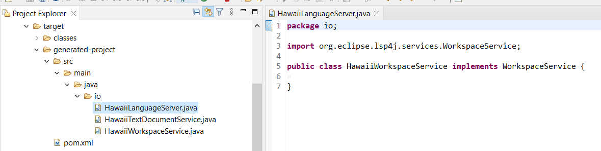

# lsgen4j

Language Server Generator which generates quickly a language server based on LSP4j:

 * main implemented classes like XXXTextDocumentService, XXXWorkspaceService
 * a maven project
 * contains all experiences that we had during some language server implementations (XML,Qute, etc) : ParentProcessWatcher, cancel checker, etc

# How to use it?

Open and Run Java class [Main.java](https://github.com/angelozerr/lsgen4j/blob/main/io.lsgen4j.generator/src/main/java/io/lsgen4j/generator/Main.java) and configure your language, base package name, etc:

```java
Configuration configuration = new Configuration();
configuration.setPackageName("io");
configuration.setLanguage("Hawaii");
configuration.setGroupId("io.hawaii");
configuration.setArtifactId("io.hawaii");
configuration.setProjectType(DefaultProjectType.SERVER_LSP4J_BASIC.getPath());
configuration.setOutDir("target/generated-project");
```

It should generate a project in your `target/generated-project` the language server project with `Hawaii` language:



# How it works?

The generated files are done with Qute with [server/lsp4j/basic](https://github.com/angelozerr/lsgen4j/tree/main/io.lsgen4j.generator/src/main/resources/templates/server/lsp4j/basic) templates base folder.

The generator loops for templates base folder and generate the same structure than other files / directories by following those rules:

 * when the source file contains `.qute.` it means that the target file must be renamed by removing .qute (ex : [pom.qute.xml](https://github.com/angelozerr/lsgen4j/blob/main/io.lsgen4j.generator/src/main/resources/templates/server/lsp4j/basic/pom.qute.xml) generate the `pom.xml`) and the source file is considered as a Qute template and will be merged with Configuration filled in the Main class.
 * when a folder contains `{` it will use Qute too to generate the path folder. For instance the folder source [packageName](https://github.com/angelozerr/lsgen4j/tree/main/io.lsgen4j.generator/src/main/resources/templates/server/lsp4j/basic/src/main/java/%7BpackageName%7D) will be replaced with `configuration.setPackageName("io");`